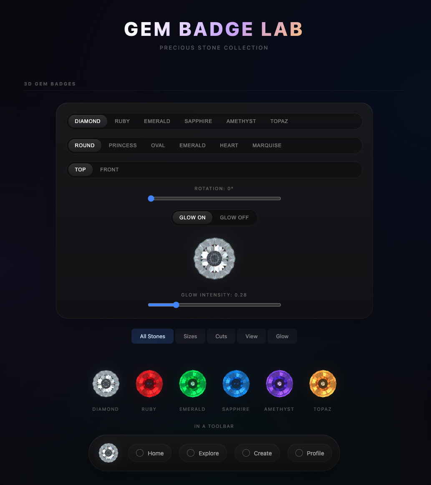

# gem-badges

Precious stone-inspired React badge and button components rendered with WebGL and THREE.js.

For the moments when your interface needs a little frost, a little drip, and just enough unnecessary luxury to feel correct.

Each badge is a physically-based 3D gem with realistic light refraction, chromatic dispersion, and per-material optical properties — diamond (IOR 2.42), ruby, emerald, sapphire, amethyst, and topaz. All cuts render fully in WebGL with a graceful DOM fallback, so yes, you can absolutely frost and drip your UI responsibly.

---

## Showcase



**GEM BADGE LAB** — interactive demo at `showcase/`

Run `bun run showcase:dev` to open the demo app:
- Interactive stone / cut / size / glow controls
- All 6 gem materials rendered side by side
- All 6 cuts (round, princess, oval, emerald, heart, marquise)
- Size scale from 28 px to 100 px
- Glow comparison: off / soft / medium / strong
- Toolbar usage example

---

## Install

```bash
bun add gem-badges
# or
npm install gem-badges
```

> **Peer dependencies:** React ≥ 18

---

## Quick start

Add one when a plain circle feels underdressed.

```tsx
import { GemBadge } from 'gem-badges'

// Defaults: diamond, round cut, 72 px, glow on
<GemBadge />

// Ruby heart badge, 48 px
<GemBadge config={{ material: 'ruby', cut: 'heart', size: 48 }} />

// Clickable sapphire badge
<GemBadge
  config={{ material: 'sapphire', cut: 'princess', size: 64 }}
  onClick={() => console.log('clicked')}
/>
```

---

## Components

### `GemBadge`

A standalone WebGL gem badge rendered as an `<span>`. Accepts a single `config` object plus any standard `HTMLSpanElement` attributes (`onClick`, `className`, `style`, `aria-*`, …).

```tsx
<GemBadge config={GemBadgeConfig} {...spanProps} />
```

#### `GemBadgeConfig`

| Prop | Type | Default | Description |
|---|---|---|---|
| `material` | `GemMaterial` | `'diamond'` | Stone preset |
| `cut` | `GemCut` | `'round'` | Facet cut shape |
| `size` | `number` | `72` | Size in CSS pixels |
| `view` | `GemView` | `'top'` | View angle (`'top'` \| `'front'`) |
| `rotation` | `number` | `0` | Rotation in degrees (0-360) |
| `glow` | `boolean` | `true` | Outer halo glow |
| `glowIntensity` | `number` | `1` | Glow multiplier (try 0.3 – 3) |
| `animate` | `boolean` | `false` | Subtle internal light animation |
| `renderMode` | `GemBadgeRenderMode` | `'auto'` | `'auto'` \| `'webgl'` \| `'dom'` |

#### Interactivity

When an `onClick` handler is passed, the badge automatically becomes a button:
- `role="button"` and `tabIndex={0}` are set
- Keyboard: `Enter` / `Space` trigger the click handler
- Hover scales to 1.04× with a transition

---

### `GemButton`

A full `<button>` element with an embedded 3D WebGL gem and animated glow.

Ideal for CTAs that deserve to arrive wearing jewelry.

```tsx
import { GemButton, DiamondButton, RubyButton } from 'gem-badges'

<GemButton gem="emerald" size="lg">Continue</GemButton>

// Pre-made convenience variants
<DiamondButton size="xl">Upgrade</DiamondButton>
<RubyButton>Delete</RubyButton>
```

#### `GemButtonProps`

| Prop | Type | Default | Description |
|---|---|---|---|
| `gem` | `GemType` | — | **Required.** Stone visual theme |
| `size` | `GemSize` | `'md'` | `'sm'` \| `'md'` \| `'lg'` \| `'xl'` |
| `glow` | `boolean` | `true` | Animated outer glow |
| `pulse` | `boolean` | `false` | Continuous glow pulse |
| `children` | `ReactNode` | — | Button label |

Plus all standard `HTMLButtonElement` attributes.

#### Pre-made button components

`DiamondButton` · `RubyButton` · `EmeraldButton` · `SapphireButton` · `AmethystButton` · `TopazButton`

All accept `GemButtonProps` minus `gem`.

---

## Reference

### `GemMaterial`

| Value | Stone | IOR | Character |
|---|---|---|---|
| `'diamond'` | Diamond | 2.42 | Bright white, blue-tinted brilliance |
| `'ruby'` | Ruby | 1.77 | Deep red |
| `'emerald'` | Emerald | 1.58 | Vibrant green |
| `'sapphire'` | Sapphire | 1.77 | Rich blue |
| `'amethyst'` | Amethyst | 1.55 | Royal purple |
| `'topaz'` | Topaz | 1.62 | Golden yellow |

### `GemCut`

| Value | Shape |
|---|---|
| `'round'` | Classic round brilliant |
| `'princess'` | Square step cut |
| `'oval'` | Elongated round |
| `'emerald'` | Rectangular step cut |
| `'heart'` | Heart shape |
| `'marquise'` | Elongated pointed |

### `GemSize` (buttons only)

| Value | Height | Gem size |
|---|---|---|
| `'sm'` | 38 px | 24 px |
| `'md'` | 46 px | 28 px |
| `'lg'` | 56 px | 34 px |
| `'xl'` | 66 px | 40 px |

### `GemBadgeRenderMode`

| Value | Behavior |
|---|---|
| `'auto'` | WebGL when available, DOM fallback otherwise |
| `'webgl'` | Force WebGL (fails silently if unsupported) |
| `'dom'` | Always use CSS/DOM fallback |

### `GemView`

| Value | Behavior |
|---|---|
| `'top'` | View from above (default) |
| `'front'` | View from the front |

---

## Examples

### Toolbar icon

```tsx
<nav style={{ display: 'flex', alignItems: 'center', gap: 12 }}>
  <GemBadge config={{ material: 'diamond', size: 32 }} />
  <span>Home</span>
</nav>
```

### Size scale

```tsx
{[28, 36, 48, 64, 80, 100].map(size => (
  <GemBadge key={size} config={{ size }} />
))}
```

### All stone types

```tsx
{(['diamond','ruby','emerald','sapphire','amethyst','topaz'] as const).map(material => (
  <GemBadge key={material} config={{ material, size: 64 }} />
))}
```

### All cuts

```tsx
{(['round','princess','oval','emerald','heart','marquise'] as const).map(cut => (
  <GemBadge key={cut} config={{ material: 'diamond', cut, size: 80 }} />
))}
```

### Glow intensity

```tsx
<GemBadge config={{ glow: false }} />                          // off
<GemBadge config={{ glow: true, glowIntensity: 0.5 }} />      // soft
<GemBadge config={{ glow: true, glowIntensity: 1.5 }} />      // strong
```

### Next.js / RSC

Add `'use client'` to any component that imports `GemBadge` or `GemButton`, as both use browser APIs (WebGL, ResizeObserver).

```tsx
'use client'
import { GemBadge } from 'gem-badges'
```

---

## Development

```bash
# Build the library
bun run build

# Watch mode
bun run dev

# Run the showcase
bun run showcase:dev   # starts on http://localhost:3000
```

---

## License

GPL-3.0-only
